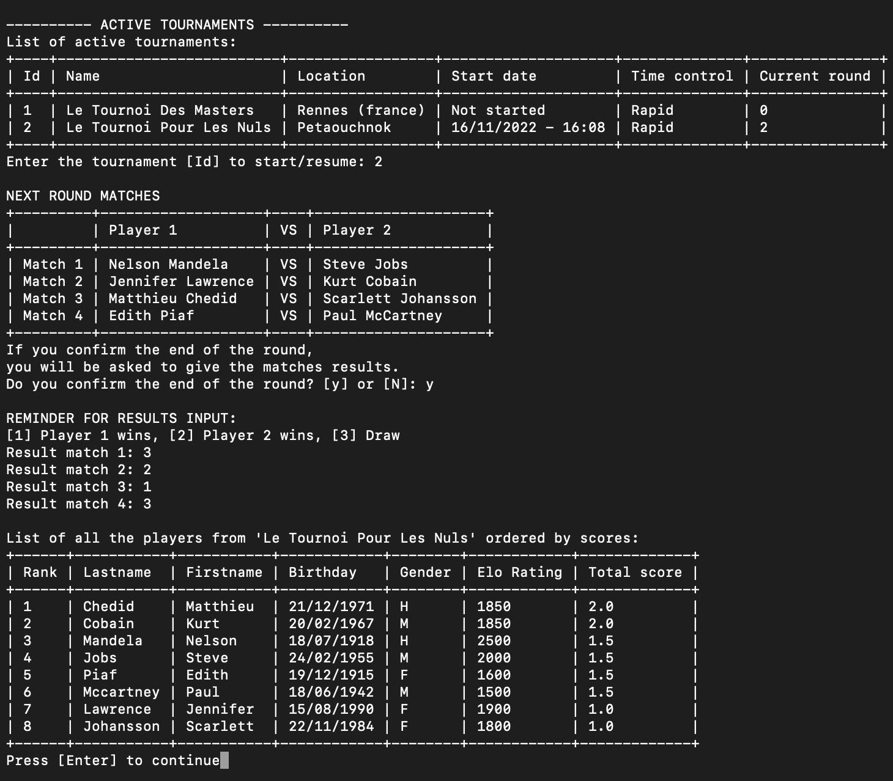
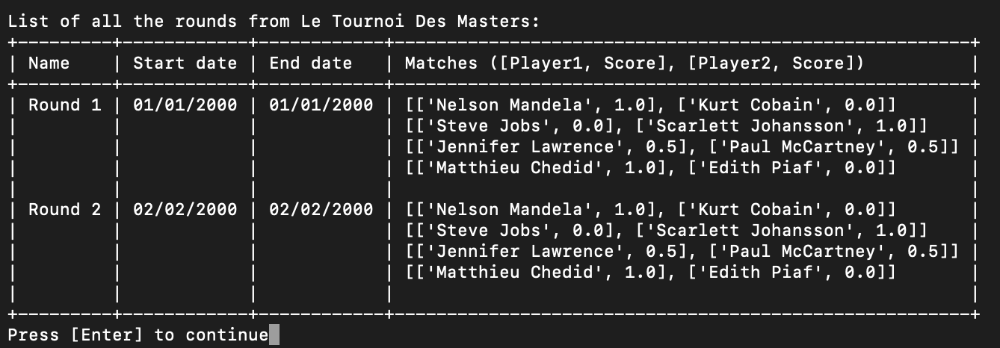

<h1 align="center">Chess Tournament Manager</h1>

    

<h4 align="center">OpenClassRooms Projet 4</h4>

    <em>Testé sous MacOS 12.6 - Python version 3.10.6</em>

## Table des matières

1. [Initialisation du projet](#id-section1)
    1. [Windows](#id-section1-1)
    2. [MacOS et Linux](#id-section1-2)
2. [Générer un rapport flake8](#id-section2)
3. [Options des menus](#id-section3)
4. [Exemples d'affichage](#id-section4)

## 1. Initialisation du projet

#### i. Windows :
Dans Windows Powershell, naviguer vers le dossier souhaité.
###### Récupération du projet

    $ git clone https://github.com/damigarn/OCR_P04_ChessTournamentManager.git

###### Activer l'environnement virtuel
    $ cd OCR_P04_ChessTournamentManager
    $ python -m venv env 
    $ ~env\scripts\activate
    
###### Installer les paquets requis
    $ pip install -r requirements.txt

###### Lancer le programme
    $ python main.py

---------

#### ii. MacOS et Linux :
Dans le terminal, naviguer vers le dossier souhaité.
###### Récupération du projet

    $ git clone https://github.com/damigarn/OCR_P04_ChessTournamentManager.git

###### Activer l'environnement virtuel
    $ cd OCR_P04_ChessTournamentManager
    $ python3 -m venv env 
    $ source env/bin/activate
    
###### Installer les paquets requis
    $ pip install -r requirements.txt

###### Lancer le programme
    $ python3 main.py

----------

## 2. Générer un rapport flake8

    $ cd OCR_P04_ChessTournamentManager
    $ flake8 --format=html --htmldir=flake8_report

**Vous trouverez le rapport dans le dossier _'flake8_report'_.**

_Dernier rapport exporté :_

## 3. Options des menus

## 4. Exemples d'affichage
#### Gestion d'un tournoi :

#### Rapport des joueurs :

#### Rapport des rondes :
